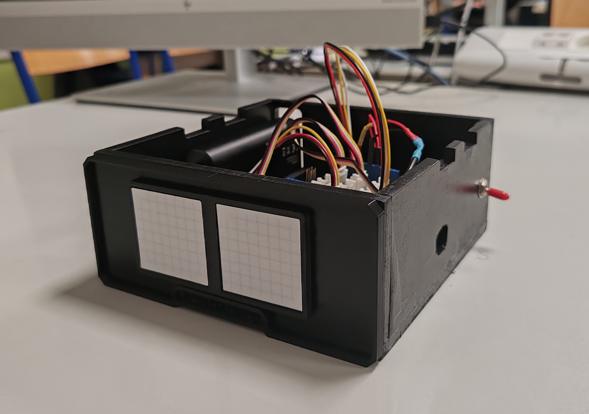

<h2 align="center">
  L1 - CMI - 2024/2025
</h2>
<h1 align="center">
  Projet Compte Personnes
</h1>

 

 
<table align="center">
  <tr>
    <th width="200">Enseignants</th>
    <th width="200">Auteurs</th>
  </tr>
  <tr>
    <td align="center">M. Gozlan</td>
    <td align="center">Mathis Hernandez</td>
  </tr>
  <tr>
    <td align="center">M. Silanus</td>
    <td align="center">Amel Naak</td>
  </tr>
</table>

 

Ce projet a été réalisé dans le contexte du cours CMI 3, au sein du CMI Informatique de l’Université d’Avignon.
Il s’inscrit dans une démarche d’apprentissage de l’électronique embarquée, de la programmation sur microcontrôleur et de l’interconnexion avec une interface numérique.

L’objectif de ce projet est de réaliser un dispositif qui permet d’évaluer le nombre de personnes regroupées dans une salle en comptant les entrées et sorties, et de rendre cette information accessible en présentiel grâce à un compteur intégré et à distance depuis un site Web.  
Nous avons alors produit un système alimenté par batterie rechargeable, fixé à la partie supérieure de l'encadrement d'une porte, qui détecte les entrées et sorties avec deux capteurs à ultrasons, afin d'afficher le compteur actuel sur place grâce à deux matrices LED et sur un ordinateur relié par câble au dispositif.

  Vous trouverez dans ce dépôt le rapport et les programmes (Arduino et site Web) de notre projet ainsi que les bibliothèques Arduino utilisées.

 

  Voici le matériel que nous avons utilisé pour réaliser ce projet :

<table align="center">
  <tr>
    <th>Besoin</th>
    <th>Composant</th>
  </tr>
  <tr>
    <td>Détecter une entrée / sortie</td>
    <td>2 capteurs à ultrasons HC-SR04</td>
  </tr>
  <tr>
    <td>Afficher le nombre de personnes présentes</td>
    <td>2 matrices LED RGB Grove 8x8</td>
  </tr>
  <tr>
    <td>Traiter les informations</td>
    <td>Carte Arduino Uno + Grove Base Shield</td>
  </tr>
  <tr>
    <td>Alimenter le système</td>
    <td>Batterie 5200mAh sortie 5V</td>
  </tr>
</table>
